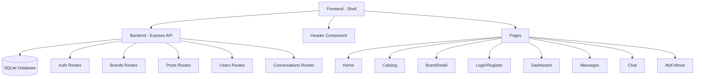
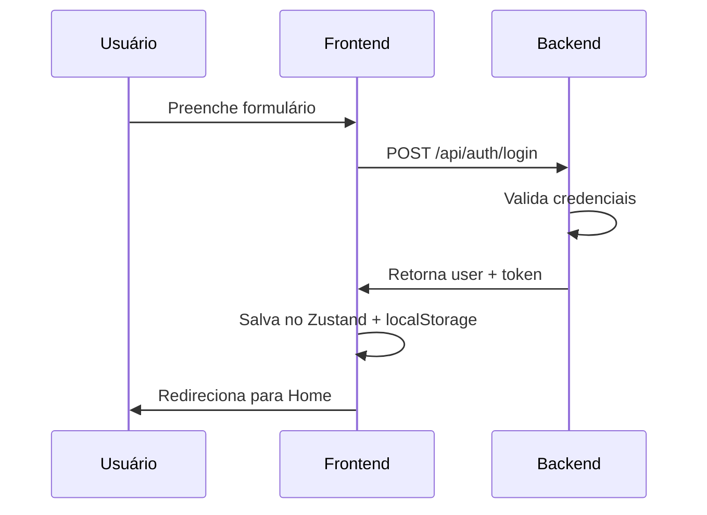
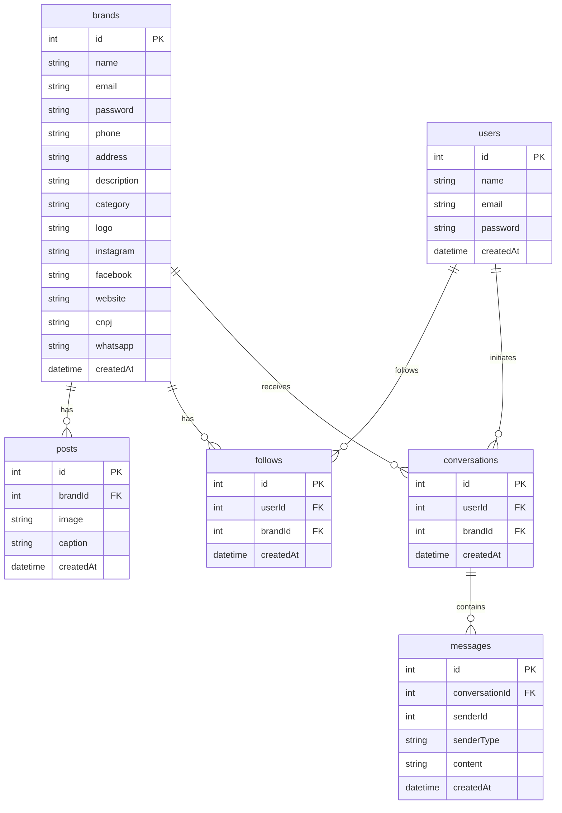

# Guiagreste - Diagramas

## Arquitetura do Sistema

```mermaid
graph TD
    A[Frontend - Shell] --> B[Backend - Express API]
    B --> C[(SQLite Database)]
    
    A --> A1[Header Component]
    A --> A2[Pages]
    A2 --> P1[Home]
    A2 --> P2[Catalog]
    A2 --> P3[BrandDetail]
    A2 --> P4[Login/Register]
    A2 --> P5[Dashboard]
    A2 --> P6[Messages]
    A2 --> P7[Chat]
    A2 --> P8[MyFollows]
    
    B --> R1[Auth Routes]
    B --> R2[Brands Routes]
    B --> R3[Posts Routes]
    B --> R4[Users Routes]
    B --> R5[Conversations Routes]
```

## Fluxo de Autenticação

```mermaid
sequenceDiagram
    participant U as Usuário
    participant F as Frontend
    participant B as Backend
    
    U->>F: Preenche formulário
    F->>B: POST /api/auth/login
    B->>B: Valida credenciais
    B->>F: Retorna user + token
    F->>F: Salva no Zustand + localStorage
    F->>U: Redireciona para Home
```

## Modelo de Dados

```mermaid
erDiagram
    brands {
        int id PK
        string name
        string email
        string password
        string phone
        string address
        string description
        string category
        string logo
        string instagram
        string facebook
        string website
        string cnpj
        string whatsapp
        datetime createdAt
    }
    
    users {
        int id PK
        string name
        string email
        string password
        datetime createdAt
    }
    
    posts {
        int id PK
        int brandId FK
        string image
        string caption
        datetime createdAt
    }
    
    follows {
        int id PK
        int userId FK
        int brandId FK
        datetime createdAt
    }
    
    conversations {
        int id PK
        int userId FK
        int brandId FK
        datetime createdAt
    }
    
    messages {
        int id PK
        int conversationId FK
        int senderId
        string senderType
        string content
        datetime createdAt
    }
    
    brands ||--o{ posts : "has"
    users ||--o{ follows : "follows"
    brands ||--o{ follows : "has"
    users ||--o{ conversations : "initiates"
    brands ||--o{ conversations : "receives"
    conversations ||--o{ messages : "contains"
```
